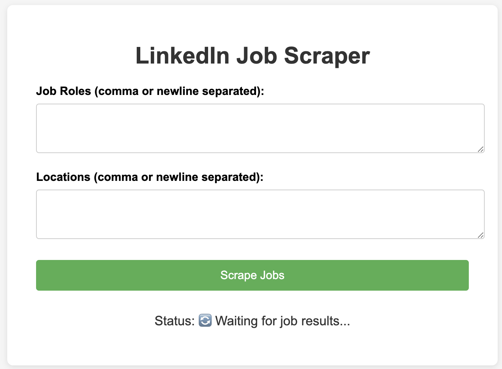
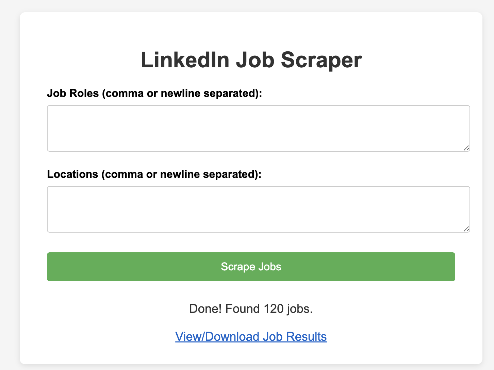
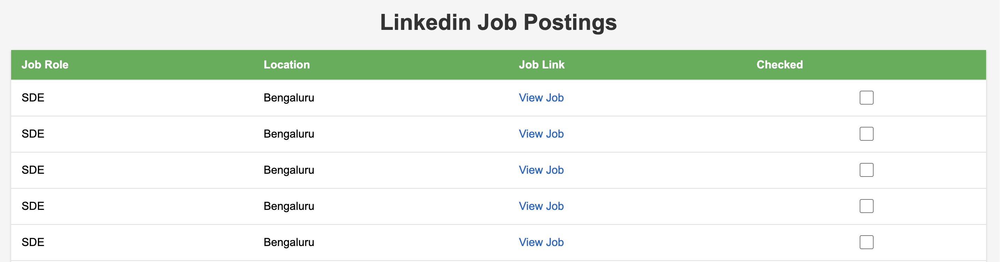

# LinkedIn Job Scraper

A Python web application to scrape recent job postings from LinkedIn (and optionally other job boards), filter them by posting date, and present the results in a user-friendly HTML format. The app features a web UI for entering job roles and locations, and supports multi-role/location input.

---

## Features

- **Web UI**: Enter multiple job roles and locations, start scraping with a button, and see live status updates.
- **Recent Jobs Only**: Scrapes only jobs posted within the last week.
- **HTML Results**: Generates a downloadable HTML file with all job links, roles, and locations.
- **Persistent Results**: All results are saved in a dedicated `result/` folder for easy management.
- **Extensible**: Code is structured to allow adding more job boards (e.g., Indeed, Glassdoor).

---

## Project Structure

```
web_scrapper/
│
├── app.py                  # Flask web application (UI and backend)
├── job_scraper.py          # Core scraping logic for LinkedIn, Indeed, Glassdoor
├── requirements.txt        # All Python dependencies
├── result/                 # Folder where all generated HTML job result files are saved
│    └── scraped_jobs_<timestamp>.html
├── templates/
│    └── job_scraper.html   # HTML template for the web UI
└── ... (other files/venv)
```

---

## Setup Instructions

1. **Clone the repository** (or copy the files to your project directory).

2. **Install dependencies**  
   Make sure you have Python 3.8+ installed.  
   Install all required packages:
   ```bash
   pip install -r requirements.txt
   ```

3. **Run the Flask app**  
   ```bash
   python app.py
   ```

4. **Open the web UI**  
   Go to [http://127.0.0.1:5000/](http://127.0.0.1:5000/) in your browser.

---

## How It Works

### 1. User Interface (`templates/job_scraper.html`)
- Enter one or more job roles (comma or newline separated).
- Enter one or more locations (comma or newline separated).
- Click **Scrape Jobs**.
- The UI shows live status updates (e.g., "Scraping jobs for SDET at Bangalore…").
- When done, a download link appears to view the results.

### 2. Backend (`app.py`)
- **Flask** serves the web UI and handles user input.
- When the user submits the form, a background thread starts scraping jobs for each role/location combination.
- The status is polled by the frontend every 2 seconds for live updates.
- When scraping is complete, the results are saved as an HTML file in the `result/` folder, and a download link is shown.

### 3. Scraping Logic (`job_scraper.py`)
- **LinkedIn Scraper**: Fetches job postings for each role/location, only including jobs posted within the last week.
- **Extensible**: Functions for Indeed and Glassdoor are present and can be enabled/extended.
- **Random User-Agent**: Uses `fake-useragent` to avoid being blocked.
- **HTML Generation**: Results are formatted into a styled HTML table with checkboxes for tracking jobs.

### 4. Results (`result/`)
- Each scrape creates a new HTML file named like `scraped_jobs_<timestamp>.html`.
- Files are served for download/viewing via the web UI.

---

## Key Files Explained

### `app.py`
- Sets up the Flask app and routes.
- Handles form submissions, starts scraping in a background thread.
- Provides a `/status` endpoint for live status polling.
- Serves result files from the `result/` directory.

### `job_scraper.py`
- Contains all scraping functions.
- `scrape_linkedin_jobs`: Main function for LinkedIn scraping.
- `save_links_to_file`: Saves results as HTML in the `result/` folder.
- Can be extended to scrape other job boards.

### `templates/job_scraper.html`
- The HTML template for the web UI.
- Uses JavaScript to poll the backend for status and update the UI live.

### `requirements.txt`
- Lists all Python dependencies, including Flask, BeautifulSoup, requests, and fake-useragent.

---

## Customization & Extensibility

- **Add More Job Boards**: Enable or extend the Indeed/Glassdoor functions in `job_scraper.py`.
- **Change Output Format**: Edit `save_links_to_file` to customize the HTML.
- **Change Result Folder**: Update the `result/` path in both `app.py` and `job_scraper.py`.

---

## Troubleshooting

- If you get errors about missing packages, run `pip install -r requirements.txt` again.
- If scraping fails, check your internet connection and ensure LinkedIn is accessible.
- For production use, consider deploying with a production WSGI server (e.g., Gunicorn) and using a reverse proxy (e.g., Nginx).

---

## Example Usage

1. Enter roles:  
   `SDET, SDET2, Software Development Engineer in Test`
2. Enter locations:  
   `Bangalore, Karnataka, India`  
   `Hyderabad, Telangana, India`
3. Click **Scrape Jobs**.
4. Wait for the status to update and download/view the results.

---

## FAQ

**Q: Can I scrape other job boards?**  
A: Yes! The code is ready for Indeed and Glassdoor. You can enable or extend those functions as needed.

**Q: Where are my results?**  
A: All results are saved in the `result/` folder. You can also download/view them from the web UI.

**Q: How do I reset the status?**  
A: The status resets automatically when you start a new scrape.

---

## License

This project is for educational and personal use. Please respect the terms of service of the job boards you scrape.

## Screenshots

### Home Page


### After Entering Role and Location and Clicking "Scrape Jobs"
 

### Final Page
